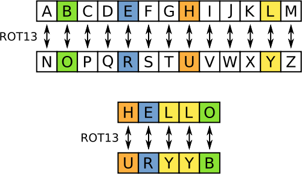
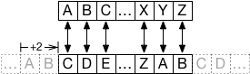

To increase security, passwords should never be stored in plain text and always be encrypted.
[ROT13](https://en.wikipedia.org/wiki/ROT13) is a very simple (and insecure) encoding that can
be used for this task. The concept is simple and illustrated in the following diagram:

Every character is being mapped to another alphabet that is shifted by
13 steps, hence the name. Because we assume 26 letters in the alphabet, ROT13 is symmetric,
meaning that the encoding of "HELLO" is "URRYB" and the encoding of "URRYB" is "HELLO".

In this task, you will create an advanced version, ROTn, that can be configured to shift by
an arbitrary number of characters. For example, a ROT2 encoder might look like this:

An "A" gets mapped to "C", because the lower band is shifted by 2. Please note that this
encoding is asymmetric, "C" would be encoded as "E".

Write a program that expects two variables to be defined, `plain_text` and `shift_by`. The
former contains the input `string` that is to be encoded, the latter is an `int` that defines
by how many steps the encoding should be shifted (e.g., 13 and 2 for the two previous
examples). You should support positive and negative shifts and also very small/large
shift sizes (even above 26) should always produce letters. Your encoding should work for (and preserve) all
lowercase and uppercase letters and leave all other parts of the string untouched. For example,
a ROT1 encoding of `"a, B, z#!"` should be `"b, C, a#!"`.

Implement it in a function `rot_n` where it should be returned. Please make sure that your solution
is self-contained within the `rot_n` function. In other words, only change the body of the function,
not the code outside the function.

While working on this task, three utilities will make your life easier: Use [*isalpha*][isalpha] to
check, if a character is alphabetic (e.g., `"a".isalpha()` is `True`), use [*ord*][ord] to get
the [ASCII][wikipedia-ascii] code of a string (e.g., `ord("a")` is `97`), and use *[chr][chr]* to
convert an [ASCII][wikipedia-ascii] code to its corresponding string (e.g., `chr(97)` is
`"a"`). Also, note that should you wish to start out with an empty string, it is defined as `""`.

[isalpha]: https://docs.python.org/3.8/library/stdtypes.html#str.isalpha
[ord]: https://docs.python.org/3.8/library/functions.html?highlight=ord#ord
[chr]: https://docs.python.org/3.8/library/functions.html?highlight=ord#chr
[wikipedia-ascii]: https://en.wikipedia.org/wiki/ASCII

