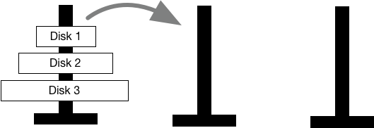

The [Towers of Hanoi](https://en.wikipedia.org/wiki/Tower_of_Hanoi) is a puzzle game, in which the player is supposed to move a stack of disks from one tower to another.

Three towers exist, among which the player can freely move the disks around. However, three rules must be respected the whole time:

* The player can only move one disk at a time.
* Only the top disk of one tower can be moved.
* Larger disks cannot be placed on top of a smaller disk.

Write a *recursive* function `req_steps`, which calculates the number of steps that are required to move a stack of `n` disks from one tower to another in an optimal game of [Towers of Hanoi](https://en.wikipedia.org/wiki/Tower_of_Hanoi). You can assume that the parameter `n` is always a positive integer and greater than 0.

**Note:** Starting with this exercise, we will provide public tests that *fail* by default. The tests we provide will *pass* for a correct solution, but keep in mind that the grading system runs many more exhaustive tests, so if the public test passes, that does not necessarily mean that your solution is 100% correct, as it might fail on certain edge or corner cases.

**Note:** The provided script defines the signature of the functions. Do not change this signature or the automated grading will fail.

**Note:** Do not define any additional variables. A recursive solution requires no external state (global variables) and no additional function-scope variables. Your solution should be self-contained in `req_steps`.

**Note:** Make sure to use a recursive approach.

