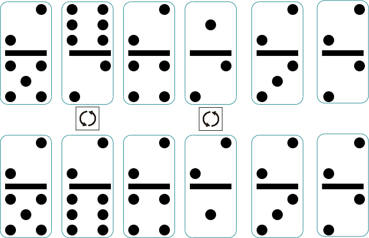

## Note

This task is quite tricky from an algorithmic standpoint. The python code is easy, but finding out how to actually solve the problem is a bit more challenging. For this reason, this task only gives 1 point. Consider it a bonus exercise. If you can't solve it, that's not a big loss for you.

## Task Outline

In this exercise, we need to rotate dominos so that the numbers on **one of the rows (either top or bottom) is all equal**. The dominos will be given as two lists of integers, one for the top row and one for the bottom row. The rotation is done by swapping the top and bottom row of a domino. Ensure you do the most efficient rotations possible.

In the case of the image below the lists would be [2,6,2,1,2,2] and [5,2,4,2,3,2]. The solution would be to rotate the second and the fourth domino, so that the top row becomes [2,2,2,1,2,2] and the bottom row becomes [2,6,4,1,3,2]. The function will return the required number of rotations which would be **2** in this example If the task is impossible, the function should return -1.

