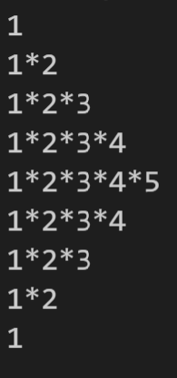

Applying nested loops often requires, that the inner loop accesses the outer loop variable.
This exercise leverages the outer loop variable as an index for the inner loop's range and thus, provides the opportunity to deepen the understanding of nested loops.
The goal of this task is to build a string that resembles a pyramid when printed to the console.
The resource folder contains examples for pyramids of different heights.
The image below depicts a pyramid of height n = 5:

## Specification of the pyramid string:
Given a parameter n for the pyramid height, the string should adhere to the following pattern:
- the number of lines of the string returned in `build_string_pyramid` should be 2*n -1.
- the n-th line should contain the numbers 1 to n where each number is separated by an asterisk `"*"` (following the pattern `1*2*3*...*n`).
- all other lines should be shorter, decreasing the last/rightmost number by one with each step further away from the n-th line, 
i.e. the line before and after the n-th line both contain the pattern `1*2*3...*n-1`, decreasing until the lines only contain a single `1`.
- h can be assumed non-negative, where height 0 is the empty string.

## Additional implementation requirements:
- The string must be built within the function `build_string_pyramid()`
- This function should RETURN the built string (not just print it to the console) as already indicated in the script file. Just leave those lines unchanged.
- The idea is to use `s = ''` as a start and just append to this empty string.

## Hints:
- use the `range()` function and take care of the indices
- use the `"\n"` newline character at the end of every line
- concatenating numbers and strings requires the `str()` function
- try to break down the problem into chunks: start by printing the first half of the pyramid and getting it to work before going on to the reverse part.

