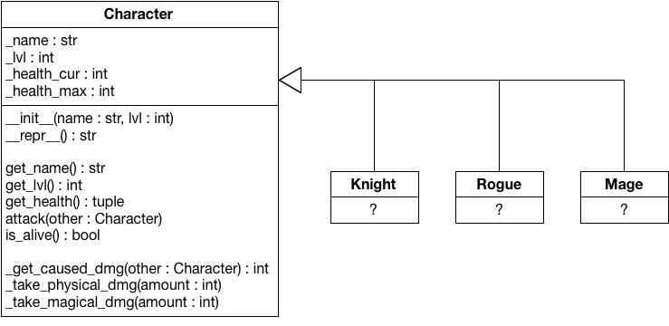

Assume that you found an abandoned code base of a role-play game that provides a nice interface, a good story, and that is overall fun. If it weren't be for the boring combat mechanics. In this initial version of the game, no classes exist and every player has the same capabilities.  In this task, you are going to extend the internal combat mechanics of this role-play game to make the game more exciting.

You will find the relevant parts of the original game in your workspace. At its core, the game has `Character`s that can fight each other. Such a `Character` is instantiated by providing a `name` and a `lvl` and several attributes are derived. More specifically, the maximum health depends on the level: characters start with 50 health on level 1 and gain 50 max health for every further level (e.g., a lvl 7 character has 350 life). Attacks deal 10 dmg per level of the attacker plus the level difference. For example, a lvl 6 char that attacks a lvl 4 char would deal 6\*10+2 damage. A counter attack would deal 4\*10-2 damage. Fights between Characters are round based, so the characters attack one after the other. For example:

    c1 = Character("Hans", 7)
    c2 = Character("Igor", 8)

    while c1.is_alive() and c2.is_alive():
        c1.attack(c2)
        if c2.is_alive():
            c2.attack(c1)
    
    print("{} won the battle".format(c1.get_name() if c1.is_alive() else c2.get_name()))

The `Character` class provides several convenient functions, for example, getters for `_name`, `_lvl`, and the health related fields, but also the interface that can be used for battles (i.e., `attack` and `is_alive`). In the current form, characters always deal physical damage (internally, `attack` calls `_take_physical_damage`), but the class already defines an extension point for magical damage (i.e., `_take_magical_damage`) that is not used so far. Please make yourself familiar with the current implementation of `Character` to understand the inner workings, the extensive test suite in `test_character.py` will serve you as documentation of the mechanics.

The previous UML diagram lists the current implementation of `Character`. Your task is it to extend the hierarchy and add three new specialized classes, *Knight*, *Rogue*, and *Mage*, which add more variability to the gameplay. A *Rogue* is a balanced class that performs physical damage. They have medium armor and can hit hard, both follows the rules defined before. *Knights* also deal physical damage. They have strong armor and can wear a shield that reduces any physical damage by 25%. Unfortunately, this comes at a price, their attacks deal 20% less damage than usual. A *Mage* has weak armor, so the damage they take from all kinds of sources is increased by 50%, however, their damage is increased by 25% and the attacks are magical.

Your implementation should enable battles between the three different classes, for example:

    k = Knight("Arthur", 12)
    m = Mage("Gandalf", 12)
    r = Rogue("Shades", 11)
    r.attack(m)
    m.attack(k)
    print("Current standings:\n- {}\n- {}\n- {}".format(k, m, r))

You have to solve this task using inheritance only. You must not change the base class `Character`, because the original maintainers might still add functionality and you want to make a later integration easy. Instead, implement the three subclasses *Knight*, *Rogue*, and *Mage* that extend the base class. Think about which methods you can inherit from the original implementation and which ones must be overridden to change the original behavior. Make sure that your extension does not break the original behavior though, e.g., health points are `int` and the `_take_..._dmg` methods only accept `int` values, so make sure to `round` any float, before passing it on. If implemented correctly, the provided `script.py` should run through.

**Hint:** Make sure that you understood the concept of a `super()` call, which might come in handy if you want to delegate the execution to an original implementation.

**Hint:** Sometimes, duplication is necessary, but generally, you should avoid repeating the same piece of code. Maintaining similar code that is spread over different classes is a nightmare!

**Hint:** You must not change `Character`, the class will be reset for the grading.

**Note:** All state must be contained within the class. Do not store information in global variables or in class variables. It must be possible to use multiple instances of the classes in parallel without suffering from side effects.

**Note:** The provided files define the signatures of various classes and functions. Do not change these signatures or the automated grading will fail.

**Note:** You can freely edit `script.py`, which is not relevant for the grading. We also strongly encourage you to add more tests to the public test suite `test_mechanics.py`.

**Note:** You have to submit three files as solution: `knight.py`, `mage.py` and `rogue.py`.