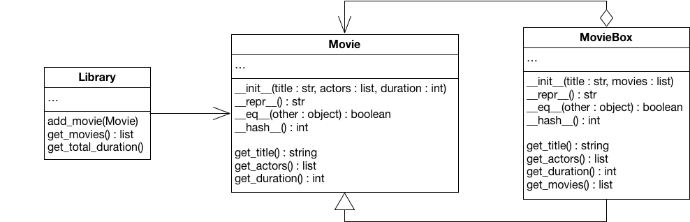

In this task, you will use inheritance to create a new subclass of a type that can aggregate other members of the same hierarchy. The technique that you will use in this task is a variation of the [Composite Pattern](https://en.wikipedia.org/wiki/Composite_pattern).

The goal is to develop a type hierarchy that can be used to manage a movie collection. The hierarchy should have two data structures. First a `Movie` that has a title, a list of actors, and the duration in minutes. The hierarchy should also contain a `MovieBox`, a collection, in which multiple movies are packed together. Such a `MovieBox` has a title, and a list of contained `Movie`s. Actors and duration are the combined result of all movies in the box. For the implementation, please consider the following UML diagram:

To make it easy to work with the two data structures, both have to implement `__eq__` and `__hash__`. They also have to implement `__repr__` and create a string that can be used to instantiate an equal instance. For example:

    repr(Movie("T", ["A", "B"], 123)) == 'Movie("T", ["A", "B"], 123)'
    repr(MovieBox("T2", [Movie("T", ["A", "B"], 123)]) == 'MovieBox("T2", [Movie("T", ["A", "B"], 123)])'

The data structures should also handle invalid instantiations. Raise a `Warning` when an empty title or an empty list of actors is provided or when the duration is not at least one minute. In addition to an empty title, a `MovieBox` should also raise a `Warning` if the provided `Movie` list is empty or an entry is not a (subtype of) `Movie`.

The important idea of a composite is that, while it groups together several elements of the same hierarchy, all these elements can be used as one. So, for example, like `Movie`, also `MovieBox` has a `get_duration` method. It does not have a duration of its own though and returns the sum of all contained `Movie`s instead (which actually could again be a `MovieBox`!). The same is true for the list of actors. The list of actors for a `MovieBox` is the combination of all lists of every contained `Movie`. Make sure that, for `MovieBox`, this list gets sorted alphabetically and that it does not contain duplicates.

Once the two data structures have been created, implement the `Library` that can be used as a central place to manage a `Movie` collection. Consider the following example:

    a = Movie("The Shawshank Redemption", ["Robbins", "Freeman"], 142)
    b = Movie("The Godfather", ["Brando", "Pacino"], 175)
    c = Movie("12 Angry Men", ["Fonda", "Cobb"], 96)
    d = MovieBox("Top Movies", [b, c])

    l = Library()
    l.add_movie(a)
    l.add_movie(d)
    print(l.get_total_duration()) # prints 413
    print(l.get_movies()) # returns the three movies c, b, a (sorted and omitting the box itself)

The library should provide two utility functions over all added `Movie` instances. `get_total_duration` should calculate the total duration of all movies in the library. As a result of the composition, the library itself does not need to know whether a `Movie` is being added or a `MovieBox`. Both have the same interface and can be used interchangeably to access actors or durations.

However, `Library` should also provide a `get_movies` method that (recursively) lists all actual movies (ordered by title) and omits the boxes. This is not modeled by the type hierarchy, so it is required to check for the concrete type of a `Movie` instance and implement a special handling for `MovieBox`. You can use `isinstance(«reference», MovieBox)` to differentiate between the subclasses.

The `add_movie` methods has to ensure that the same movie is not added multiple times. However, an existing movie can also be contained in a new movie box, which would be valid. Therefore, also the `get_movies` method needs to make sure that the result does not contain duplicates.

**Hint:** In general, using *type checks* like `isinstance` is considered to be bad style, because the extensibility of your code suffers. This is out of scope for Info1 though and you will learn better techniques for such a distinction in advanced programming courses such as *Software Engineering* and *Software Construction*, for example, *double dispatch* using the (Visitor pattern)[https://en.wikipedia.org/wiki/Visitor_pattern].

**Note:** All state must be contained within the classes. Do not store information in global variables or in class variables. It must be possible to use multiple instances of the classes in parallel without suffering from side effects.

**Note:** The provided files define the signatures of various classes and functions. Do not change these signatures or the automated grading will fail.

**Note:** You can freely edit `script.py`, which is not relevant for the grading. We also strongly encourage you to add more tests to the public test suite `test_library.py`.

**Note:** You have to submit three files as solution: `library.py`, `movie.py` and `moviebox.py`.
