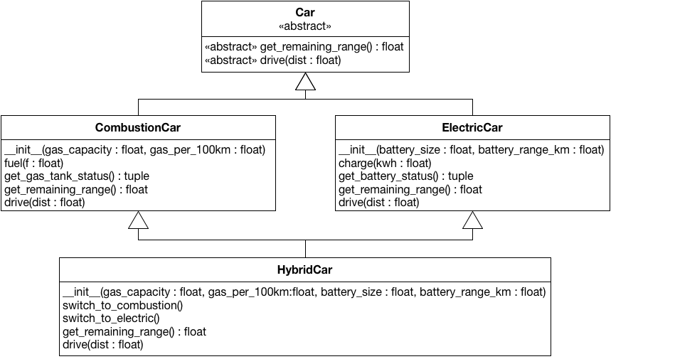

In this task you will model an object-oriented hierarchy for various car types that is illustrated in the following UML diagram.

The root of the hierarchy is the *abstract base class* `Car`. The abstraction is modeled from the perspective of a driver and defines two abstract methods: `get_remaining_range` returns the remaining distance in kilometers (float) and `drive` can be used to drive the car for `dist` kilometers. `Car` has two direct subtypes, `CombustionCar` and `ElectricCar` . Both car types are used differently. 

`CombustionCar`s are initiated with the `gas_capacity` in liters and `gas_per_100km` that describes the fuel consumption. The car can be refueled using `fuel`, which adds `f` liters of fuel to the gas tank. The method should raise a `Warning`, if the gas tank gets overfilled. A call to `get_gas_tank_status` returns the current gas tank capacity `c` and the maximum capacity `c_max` as a tuple `(c, c_max)`. It must always be that 0 <= c <= c_max. To make a `CombustionCar` usable, the two abstract methods `get_remaining_range` and `drive` need to be implemented. On use, `drive` should remove the correct amount of gas from the gas tank and it should raise a `Warning` if the gas tank is fully depleted through driving. Please consider the following example that illustrates a car usage:

    c = CombustionCar(40.0, 8.0)
    c.get_remaining_range() # 500
    c.drive(25.0)
    c.get_gas_tank_status() # (38.0, 40.0)
    c.drive(1000.0) # fuel is depleted, Warning raised

`ElectricCar`s are initiated with a `battery_size` in kilo-watt hours and the range of a fully charged battery in kilometers. The battery can be recharged with `kwh` kilo-watt hours by calling `charge`. Like for `CombustionCar`, over-charging should raise a `Warning`. Also `get_battery_status` is very similar to the `CombustionCar` equivalent and should return the current and the maximum capacity in a tuple `(c, c_max)`. `drive` and `get_remaining_range` need to be implemented as well and should affect/be affected by the battery charge level.

    e = ElectricCar(25.0, 500.0)
    e.drive(100.0)
    e.charge(2.0)
    e.get_battery_status() # (22.0, 25)

Finally, `HybridCar` inherits all properties and functionalities of the other two car types and, as such, needs all parameters for the initialization. The two methods `switch_to_combustion` and `switch_to_electric` can be used to change the operation mode. Should the car run out of fuel or battery during a tour, it should automatically switch the mode. If both modes are fully depleted, the car should raise a `Warning`. `HybridCar` inherits two conflicting definitions of the methods `get_remaining_range` and `drive`, adapt the implementations to make them work. The usage of a hybrid car is similar to the previous examples:

    h = HybridCar(40.0, 8.0, 25.0, 500.0)
    h.switch_to_combustion()
    h.drive(600.0) # depletes fuel, auto-switch
    h.get_gas_tank_status() # (0.0, 40.0)
    h.get_battery_status() # (20.0, 25.0)

The implementations of the different cars should handle invalid parameters like capacities, fuel/charge amounts, or distances that are negative or that do have a different type than expected. Raise a `Warning` in all these cases. Make sure that gas tank/battery are set to `0` when you raise a `Warning`.

**Note:** After initializing a car, gas tanks and batteries are full and a `HybridCar` should operate in electrical mode.

**Note:** The `super` keyword makes it easy to call a method defined by the parent type. However, in the context of multiple inheritance, it is often easier to use the slightly more convoluted style and directly name the right method by class, e.g., `MySuperClass.someMethod(self, ...)`.

**Note:** An abstract base class extends `ABC` and adds the annotation `@abstractmethod` to abstract methods.

**Note:** All state must be contained within the classes. Do not store information in global variables or in class variables. It must be possible to use multiple instances of the classes in parallel without suffering from side effects.

**Note:** The provided files define the signatures of various classes and functions. Do not change these signatures or the automated grading will fail.

**Note:** You can freely edit `script.py`, which is not relevant for the grading. We also strongly encourage you to add more tests to the public test suite `test_cars.py`.

**Note:** You have to submit four files as solution: `car.py`, `combustion_car.py`, `electric_car.py` and `hybrid_car.py`.