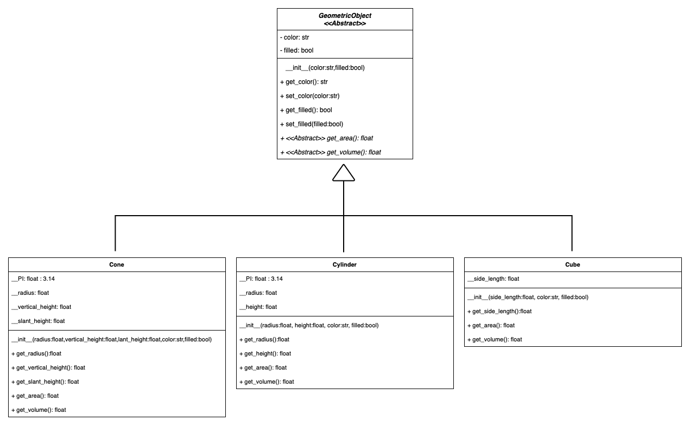
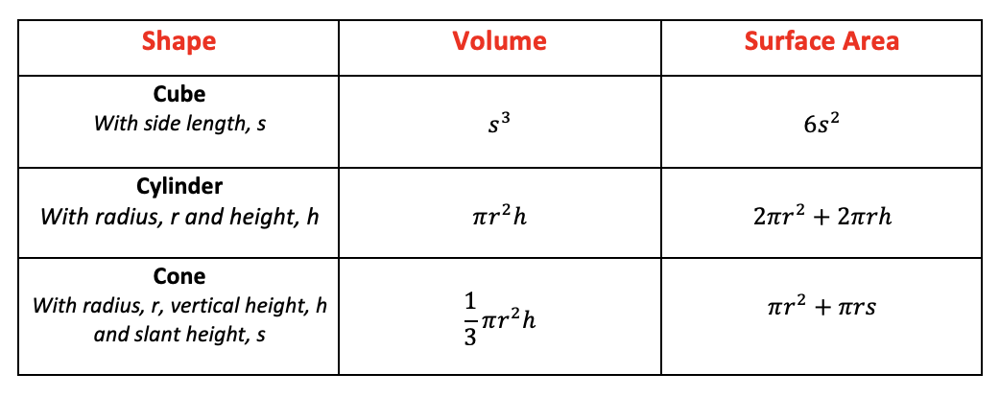

In this task you will build a simple object-oriented hierarchy for geometric objects as per the following UML diagram.

Geometric objects have many common attributes and behaviours. They can be drawn in a certain color and be filled or unfilled. Thus a general class `GeometricObject` can be used to model all geometric objects. This generic class contains `color` and `filled` attributes and their getters and setters. Also `GeometricObject` class contains `get_area` and `get_volume` functions. These functions are not implemented in the `GeometricObject` class since there is no a common formula to calculate area and volume for each geometric objects. Thus `get_area` and `get_volume` functions are `abstract` functions so they **must** be implemented in the subclasses. As a result of this `abstract` functions `GeometricObject` class becomes an `abstract` class as `abstract` classes are classes that contain one or more `abstract` functions.

Special type of geometric objects can extend `GeometricObject` class in order to inherit common attributes and functions. Each special geometric object has it's unique behaviours and attributes in addition to inherited ones. For example a `cone` object has `side_length` attribute while a `cylinder` object has `radius` and `height` attributes. But both `cone` and `cylinder` objects has `color` attribute in common since they both extends `GeometricObject` class.

## Task Details

* Your task is to build the object-orietened hierarchy as per the UML diagram above. 
* You should implement `Cone`,`Cube` and `Cylinder` classes.
* For the sake of simpilicty you are not required to implement setters for specialized geometric classes `Cone`,`Cube` and `Cylinder`. You should only implement getters for their instance attributes.
* Each special geometric object has it's unique formula to calculate area and volume. You need to apply these formulas in the appropriate functions. You can find the formulas in the table below.

 

* `get_area` and `get_volume` functions should return `float` with rounded to 2 decimal points. I.e. Calculated area 19.32494 should be returned as 19.32
* You should take `PI` as `3.14` .