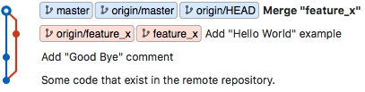

Developers are using *branches* to work on features in isolation and to avoid edit conflicts in the repository. In this task, we will test whether you know how to `branch` and `merge` with Git.

Like in the last task, you have to clone the repository at `$REPO_URL`. By default, the repository will be on the `master` branch after the checkout. Perform the following steps to solve this task:

* Clone the repository at `$REPO_URL` into the folder `repo`.
* Change the working directory to the new folder (using the command `cd`).
* Create a new branch with the name `feature_x`
* Switch to the newly created branch
* Create a new file `hello.py` with the content `print("Hello World!")`
* Add and commit the changes using the message `Add "Hello World" example`.
* Push the new branch to the repository (branches that do not yet exist on the remote must be explicitly named, for example, by invoking `git push origin «your branch»`)
* Switch back to the master branch
* To emulate another developer that has worked on the repository in parallel, create a file `bye.py` with the content `# good bye`, add it to the index, and commit it to the `master` branch with the commit message `Add "Good Bye" comment`.
* Now, merge your own feature branch into the master branch and use the commit message `Merge "feature_x"`. Like `commit`, `merge` would normally open an editor, but ACCESS is non-interactive, so use the `-m` parameter.
* Push `master` to the remote.

If you run the script on your local machine and inspect the Git tree with a graphical client, it should look like the following screenshot. Of course, the base commit (lowest entry) depends on the previous contents of the repository that you will use.

**Note:** After executing the script, your index should be clean and there should be no changed files in your working directory.

**Note:** Use `$REPO_URL` and do not change the folder name or the grading script will fail. If you want to test your script locally, you can provide an arbitrary Git repository URL when running the script, just execute the command `REPO_URL="http://some.server.com/yourname/yourrepo" ./script.sh`.

**Note:** Your scripts cannot access the internet and will timeout if you try.
